# 🏗️ Runtime Architecture — Job Hunting Agent

This document details the high-level runtime architecture of the **Job Hunting Agent**, outlining trust boundaries, core processing components, primary execution flows, and external dependencies.

---

## 1. High-Level Runtime Architecture Diagram

```mermaid
flowchart TD
    %% Trust Boundaries
    subgraph TB_Client ["Trust Boundary: Client & User Tier (Untrusted)"]
        UI["1. Streamlit Web UI / CLI Client\n(app.py / cli.py)"]
    end

    subgraph TB_Gateway ["Trust Boundary: Ingestion & API Edge"]
        API["2. FastAPI REST Gateway\n(api.py)"]
    end

    subgraph TB_Core ["Trust Boundary: Trusted Agent Execution Engine (LangGraph Core)"]
        WF["3. LangGraph Workflow Orchestrator\n(StateGraph + MemorySaver)"]
        PARSER["4. Resume Parser & Term Extractor\n(resume_parser.py / term_extractor.py)"]
        QGEN["5. Query Generator\n(query_generator.py)"]
        SEARCH["6. Search & Deduplication Dispatcher\n(job_searcher.py / deduplicator.py)"]
        RANK["7. Map-Reduce Job Ranker & Scorer\n(job_ranker.py)"]
        TAILOR["8. Application Tailoring Engine\n(tailor.py)"]
        VEC["9. Semantic Vector Search Engine\n(vector_search.py)"]
    end

    subgraph TB_Storage ["Trust Boundary: Local Persistence & Storage"]
        DB[("10. SQLite Database & Storage Manager\n(database/manager.py)")]
        EXPORTS[("11. Application Materials Exports\n(exports/*.md)")]
    end

    subgraph TB_External ["Trust Boundary: External Third-Party Services (Untrusted Network)"]
        LLM["12. Google Gemini LLM API\n(Flash 2.0 / Pro 1.5)"]
        SEARCH_EXT["13. Search Providers API\n(DuckDuckGo / Tavily API)"]
    end

    %% Primary Execution Path (Thick Highlighted Arrows)
    UI ==>|"1. Upload Resume & Search Criteria"| API
    API ==>|"2. Initialize Thread & Invoke"| WF
    WF ==>|"3. Extract Profile & Technical Terms"| PARSER
    PARSER ==>|"4. Structured Keywords"| QGEN
    QGEN ==>|"5. Dispatch Async Queries"| SEARCH
    SEARCH ==>|"6. Raw Deduplicated Postings"| RANK
    RANK ==>|"7. Top Filtered Candidates"| TAILOR
    TAILOR ==>|"8. Tailored Bullets & Cover Letter"| DB
    DB ==>|"9. Persist Markdown Package"| EXPORTS

    %% Secondary Runtime Integrations
    PARSER -.->|"Embeddings Math"| VEC
    QGEN -.->|"Fast Query Inference"| LLM
    SEARCH -.->|"HTTP Scraping / API"| SEARCH_EXT
    RANK -.->|"Map-Reduce Evaluation"| LLM
    TAILOR -.->|"Reasoning & Synthesis"| LLM
    DB -.->|"State & Application History"| API

    %% Styling
    classDef primary fill:#2b5c8f,stroke:#4a90e2,stroke-width:2px,color:#ffffff;
    classDef external fill:#4a3b32,stroke:#d97736,stroke-width:2px,color:#ffffff;
    classDef storage fill:#2a4836,stroke:#48bb78,stroke-width:2px,color:#ffffff;
    classDef boundary fill:#1e1e24,stroke:#666,stroke-dasharray: 4 4;

    class UI,API,WF,PARSER,QGEN,SEARCH,RANK,TAILOR,VEC primary;
    class DB,EXPORTS storage;
    class LLM,SEARCH_EXT external;
```

---

## 2. Core Component Cards

### 🖥️ Client & Gateway Layer

> #### **Card 1: Client Interfaces**
> * **Files**: [`app.py`](./app.py) | [`cli.py`](./cli.py)
> * **Role**: Entry points for user interaction. Provides drag-and-drop resume ingestion, search filter parameterization, live job match cards, and interactive Rich CLI tables.
> * **Inputs / Outputs**: User uploaded files (PDF/DOCX/TXT) and preferences $\rightarrow$ Formatted API/Workflow requests.

> #### **Card 2: FastAPI REST Gateway**
> * **Files**: [`api.py`](./api.py)
> * **Role**: Asynchronous HTTP gateway exposing endpoints for resume parsing (`/api/v1/resume/parse`), job workflow invocation (`/api/v1/jobs/search`), and application tailoring (`/api/v1/applications/tailor`).
> * **Security / Boundary**: Validates payload schemas via Pydantic models before passing parameters into internal execution graph.

---

### ⚙️ Orchestration & Agent Core

> #### **Card 3: LangGraph Workflow Orchestrator**
> * **Files**: [`core/workflow.py`](./core/workflow.py) | [`core/state.py`](./core/state.py)
> * **Role**: Manages state transitions across all processing nodes using a strictly typed `AgentState` and in-memory checkpointing (`MemorySaver`) for execution continuity.
> * **Execution Model**: Linear directed graph: `parse_resume` $\rightarrow$ `extract_terms` $\rightarrow$ `generate_queries` $\rightarrow$ `search_jobs` $\rightarrow$ `rank_jobs` $\rightarrow$ `tailor_application`.

> #### **Card 4: Resume Parser & Term Extractor**
> * **Files**: [`core/resume_parser.py`](./core/resume_parser.py) | [`core/term_extractor.py`](./core/term_extractor.py)
> * **Role**: Ingests multi-format resumes with Unicode sanitization; extracts skills, domain knowledge, and career level to construct the candidate profile.

> #### **Card 5: Query Generator Node**
> * **Files**: [`core/query_generator.py`](./core/query_generator.py)
> * **Role**: Leverages fast LLM inference (`gemini-2.0-flash`) to generate structured, Boolean-optimized search queries targeted for real-world job portals.

> #### **Card 6: Search & Deduplication Dispatcher**
> * **Files**: [`core/job_searcher.py`](./core/job_searcher.py) | [`core/search_providers.py`](./core/search_providers.py) | [`core/deduplicator.py`](./core/deduplicator.py)
> * **Role**: Executes parallel async web searches via DuckDuckGo/Tavily. The `DeduplicationEngine` strips tracking query params (`utm_*`, `gclid`) and enforces canonical uniqueness over `(company, title)` pairs.

> #### **Card 7: Map-Reduce Job Ranker & Scorer**
> * **Files**: [`core/job_ranker.py`](./core/job_ranker.py)
> * **Role**: Chunks job listings into batches of 5, evaluating them concurrently against a 4-part weighted scoring rubric:
>   * **Technical Fit (40%)** | **Seniority Alignment (30%)** | **Domain Relevance (20%)** | **Work Conditions (10%)**

> #### **Card 8: Application Tailoring Engine**
> * **Files**: [`core/tailor.py`](./core/tailor.py)
> * **Role**: Generates 3–5 Google XYZ-style resume bullet points and personalized 3-paragraph cover letters tailored to the candidate's top matched job listings.

> #### **Card 9: Semantic Vector Search Engine**
> * **Files**: [`core/vector_search.py`](./core/vector_search.py)
> * **Role**: Computes cosine similarity between candidate resume embeddings and job description vectors to uncover latent semantic matches with fallback text similarity.

---

### 💾 Persistence & External Boundaries

> #### **Card 10: SQLite Storage & Database Manager**
> * **Files**: [`database/manager.py`](./database/manager.py) | `database/job_hunting_agent.db`
> * **Role**: Persists application histories, cached search results, tailored cover letters, and candidate search preference snapshots.

> #### **Card 11: External LLM & Web Search APIs**
> * **Files**: [`core/dependencies.py`](./core/dependencies.py) | [`config/settings.py`](./config/settings.py)
> * **Role**: Tiered Google Gemini inference (`gemini-2.0-flash` for high-throughput query generation, `gemini-1.5-pro` for deep ranking) and external web search providers (DuckDuckGo Search / Tavily API).

---

## 3. Trust Boundaries & Security Model

| Boundary | Components Included | Security & Isolation Policies |
| :--- | :--- | :--- |
| **Client / User Tier** | Streamlit UI, Rich CLI | Untrusted boundary; inputs must be validated and sanitized before passing downstream. |
| **API Edge & Ingestion** | FastAPI Gateway | Input sanitization, file MIME-type inspection, payload size bounding. |
| **Trusted Agent Core** | LangGraph Workflow, Parsers, Evaluator, Tailor | Internal orchestration runtime; operates over typed Pydantic models with memory isolation. |
| **Local Persistence** | SQLite DB, Exports folder | Local trusted storage; parameterized SQL queries to prevent injection. |
| **External Cloud Services** | Google Gemini API, DDGS/Tavily | Untrusted network egress; API keys managed via environment variables (`.env`). |
