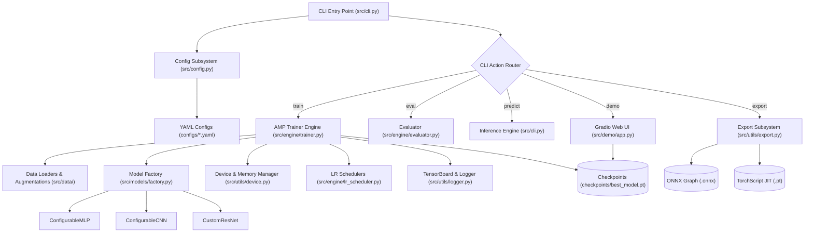
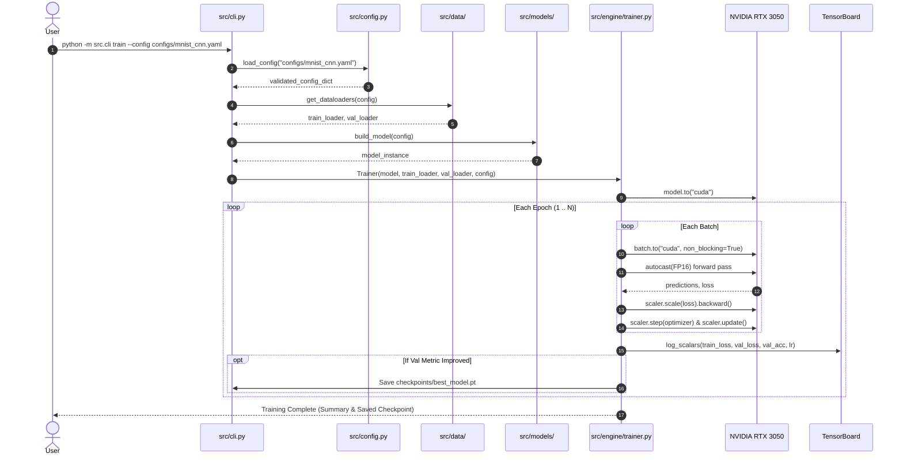
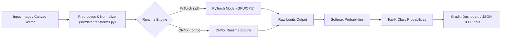

# Architecture: Config-Driven PyTorch Deep Learning Framework

> **Status:** Active Reference Architecture  
> **Target Hardware:** NVIDIA GeForce RTX 3050 Laptop GPU (4 GB VRAM)  
> **Runtime Environment:** Python 3.12 (`uv`), PyTorch 2.6 (`cu124`), CUDA 12.4  

---

## 1. Executive Architecture Summary

The **Config-Driven PyTorch Deep Learning Framework** is a modular, high-performance computer vision and deep learning platform engineered for production maintainability, rapid experimentation, and resource-efficient training on modern consumer and laptop GPUs.

### Core Architectural Principles
1. **Zero Hardcoded Hyperparameters (Config-Driven Execution):** Every aspect of execution—model dimensions, activations, regularization, dataset splits, augmentations, optimizer parameters, learning rate schedules, and mixed-precision flags—is declared via validated YAML configuration files with dynamic CLI override support.
2. **Strict Subsystem Decoupling:** Data loading, neural network graph definition, execution engine, observability, and deployment export are isolated into cohesive modules with explicit interfaces.
3. **GPU-First Architecture with Safe CPU Fallback:** Compute routines automatically leverage NVIDIA CUDA tensor cores with cuDNN benchmarking enabled, while providing safe fallback for CPU environments.
4. **4 GB VRAM Footprint Optimization:** Leverages PyTorch Automatic Mixed Precision (AMP / FP16) and gradient scaling to achieve a $2\times$ throughput speedup while keeping peak memory overhead safely below hardware limits ($< 3.2\text{ GB}$).
5. **Multi-Target Deployment Ready:** Integrated model export pipelines support static graph ONNX export (verified against `onnxruntime`) and TorchScript JIT tracing for low-latency inference.

---

## 2. High-Level System Architecture

The following diagram illustrates the relationship between the command-line interface, configuration subsystem, data pipelines, model factory, training engine, observability, export targets, and user-facing demo interfaces:



---

## 3. Directory & Package Layout

```text
NeuralNetworks_From_Scratch/
├── configs/
│   ├── mnist_mlp.yaml              # Config for MNIST MLP baseline
│   ├── mnist_cnn.yaml              # Config for MNIST Deep CNN
│   ├── fashion_mnist.yaml          # Config for Fashion-MNIST
│   └── cifar10_resnet.yaml         # Config for CIFAR-10 Residual Network
├── src/
│   ├── __init__.py                 # Root package initialization
│   ├── cli.py                      # Unified CLI: train, eval, predict, export, demo
│   ├── config.py                   # YAML schema validation & parsing
│   ├── data/
│   │   ├── __init__.py             # Data package exports
│   │   ├── dataset.py              # PyTorch Dataset loaders (MNIST, Fashion-MNIST, CIFAR-10, ImageFolders)
│   │   └── transforms.py           # Augmentation pipelines (torchvision v2 transforms) & Normalization
│   ├── models/
│   │   ├── __init__.py             # Model package exports
│   │   ├── mlp.py                  # Configurable arbitrary-depth MLP with BatchNorm & Dropout
│   │   ├── cnn.py                  # Modular Deep CNN with spatial downsampling & adaptive pooling
│   │   ├── resnet.py               # Custom Residual Networks with residual projection blocks
│   │   └── factory.py              # Model factory instantiation and parameter counting
│   ├── engine/
│   │   ├── __init__.py             # Engine package exports
│   │   ├── trainer.py              # Production Trainer: AMP (FP16), Checkpointing, Early Stopping
│   │   ├── evaluator.py            # Evaluation loop & metrics (Accuracy, Top-k, Confusion Matrix)
│   │   ├── optimizer.py            # Optimizer builder (AdamW, Adam, SGD+Momentum, RMSprop)
│   │   └── lr_scheduler.py         # Dynamic LR schedulers (CosineAnnealing, OneCycleLR, StepLR)
│   ├── utils/
│   │   ├── __init__.py             # Utilities package exports
│   │   ├── device.py               # GPU memory manager & CUDA device handler for 4GB VRAM
│   │   ├── logger.py               # TensorBoard writer & progress bar logging
│   │   ├── checkpoint.py           # Atomic weight serialization & resumption
│   │   ├── visualizer.py           # Confusion matrix, ROC curves & feature map visualizers
│   │   └── export.py               # ONNX & TorchScript model export utilities
│   └── demo/
│       ├── __init__.py             # Demo package exports
│       └── app.py                  # Interactive Gradio Web App (canvas drawing & classification)
├── tests/                          # Automated Pytest suite
│   ├── conftest.py                 # Pytest fixtures and mock data generators
│   ├── test_models.py              # Architecture dimensions & forward pass tests
│   ├── test_data.py                # Data loading, batch shapes & transform tests
│   └── test_trainer.py             # Micro-training loop, AMP & checkpoint tests
├── runs/                           # TensorBoard experiment event logs
├── checkpoints/                    # Saved model weights (.pt)
├── outputs/                        # Exported models (.onnx) and visualization plots (.png)
├── ROADMAP.md                      # Ordered, actionable phase-by-phase backlog
├── ARCHITECTURE.md                 # Complete system reference architecture
├── README.md                       # High-level overview & quickstart guide
├── requirements.txt                # Production dependencies
└── pyproject.toml                  # Package metadata & tool configurations (ruff, pytest)
```

---

## 4. Core Subsystems & Module Specifications

### 4.1 Configuration Subsystem (`src/config.py`)
* **Responsibility:** Load, parse, validate, and provide strongly-typed access to experiment configurations.
* **Schema Hierarchy:**
  * `model`: Model type (`mlp`, `cnn`, `resnet`) and layer-specific parameters.
  * `dataset`: Dataset identifier (`mnist`, `fashion_mnist`, `cifar10`, `image_folder`), root path, batch size, number of workers, and augmentations.
  * `training`: Epochs, optimizer (`adamw`, `sgd`, `rmsprop`), learning rate, weight decay, gradient clip value, mixed precision (`amp: true/false`), early stopping patience.
  * `scheduler`: Type (`cosine`, `onecycle`, `step`), warmup epochs, minimum learning rate.
  * `logging`: Experiment name, TensorBoard output directory, log interval.
* **CLI Overrides:** Allows overriding nested config keys directly from the terminal (e.g. `--epochs 20 --lr 0.0005`).

### 4.2 Data Engineering Subsystem (`src/data/`)
* **`dataset.py`:** Unified dataset factory returning train, validation, and test splits. Supports automated downloading and local caching for standard vision benchmarks and custom folder hierarchies.
* **`transforms.py`:** Configurable preprocessing and data augmentation pipelines utilizing modern `torchvision.transforms.v2`:
  * *Training:* RandomCrop with padding, RandomRotation, ColorJitter, RandomAffine, followed by Tensor conversion and dataset-specific channel normalization.
  * *Inference/Validation:* Deterministic resize/center crop and normalization.
* **DataLoader Optimization:** Configured with `pin_memory=True`, `persistent_workers=True`, and `num_workers=2` to ensure continuous data streaming with zero GPU starvation.

### 4.3 Model Zoo & Factory (`src/models/`)
* **`mlp.py` (`ConfigurableMLP`):** Fully connected network supporting arbitrary depth via dynamic hidden dimension lists (e.g., `[784, 512, 256, 128, 10]`), selectable non-linearities (`relu`, `gelu`, `silu`, `leaky_relu`), optional 1D batch normalization, and dropout.
* **`cnn.py` (`ConfigurableCNN`):** Multi-stage convolutional network with parameterized convolutional blocks (Conv2d $\to$ BatchNorm2d $\to$ Activation $\to$ Dropout2d $\to$ MaxPool2d) and an `AdaptiveAvgPool2d((1, 1))` pooling neck that accommodates varying input spatial dimensions.
* **`resnet.py` (`CustomResNet`):** Residual network built from `ResidualBlock` modules featuring $3\times3$ convolutions, residual skip additions, and optional $1\times1$ projection shortcuts for dimension-matching across stages.
* **`factory.py` (`build_model`):** Factory function instantiating model graphs from configuration dictionaries. Includes `count_parameters()` reporting total vs. trainable parameters.

### 4.4 Training Engine (`src/engine/`)
* **`trainer.py` (`Trainer`):**
  * **Automatic Mixed Precision (AMP):** Runs forward passes inside `torch.amp.autocast('cuda')` and scales gradients using `torch.amp.GradScaler('cuda')` for numerical stability and FP16 throughput.
  * **Gradient Clipping:** Uses `torch.nn.utils.clip_grad_norm_` to stabilize deep residual networks.
  * **Validation Routine:** Computes validation loss and top-1/top-5 accuracy at the end of each epoch.
  * **Checkpointing & Early Stopping:** Automatically serializes `best_model.pt` when validation metric achieves a new optimum, and terminates training if no improvement occurs within `patience` epochs.
* **`evaluator.py` (`Evaluator`):** Calculates multi-class performance metrics: categorical cross-entropy loss, Top-1 accuracy, Precision, Recall, F1 score, and Confusion Matrix generation.
* **`lr_scheduler.py`:** Builds dynamic learning rate schedules:
  * `CosineAnnealingLR` with optional warmup steps.
  * `OneCycleLR` for fast super-convergence training.
  * `StepLR` / `MultiStepLR` for discrete decay schedules.

### 4.5 GPU & VRAM Safety Strategy (`src/utils/device.py`)
Designed specifically for the **NVIDIA RTX 3050 Laptop GPU (4 GB VRAM)**:
* **CUDA Optimization Flags:** Sets `torch.backends.cudnn.benchmark = True` for auto-tuned convolution algorithms.
* **Memory Monitoring:** Real-time VRAM query functions (`get_memory_allocated()`, `get_memory_reserved()`) reporting utilization in MB and GB.
* **OOM Prevention Thresholds:** Issues warnings if memory reservation exceeds 3.4 GB ($85\%$ of total 4 GB VRAM) and provides `clear_gpu_cache()` routines.

### 4.6 Observability & Logging (`src/utils/logger.py`)
* **TensorBoard Integration:** Logs training loss, validation loss, step-level learning rates, validation accuracy, and weight gradient distributions to `runs/<experiment_name>`.
* **Console Reporting:** Clean progress bars powered by `tqdm` reporting live batch loss, running average accuracy, and estimated time of arrival (ETA).

### 4.7 Model Optimization & Deployment (`src/utils/export.py`)
* **ONNX Export:** Generates static computational graphs (`.onnx`) with dynamic batch axes (`batch_size`), opset version 17+, and verifies output consistency using `onnxruntime.InferenceSession`.
* **TorchScript Export:** Traces and compiles models into standalone TorchScript `.pt` archives runnable in C++ production runtimes without Python dependencies.

### 4.8 Interactive User Interface (`src/demo/app.py`)
* **Gradio Application:**
  * **Interactive Canvas:** Drawing canvas allowing users to draw digits/sketches directly in the browser.
  * **Image File Upload:** Drag-and-drop image classifier for Fashion-MNIST and CIFAR-10 classes.
  * **Real-Time Visualizations:** Displays top-5 predicted class probabilities as interactive bar charts and generates intermediate feature map heatmaps.

---

## 5. End-to-End Data & Control Flow

### 5.1 Training Execution Sequence


---

### 5.2 Inference & Deployment Flow


---

## 6. Quality Gates & Reliability Strategy

### 6.1 Automated Test Suite (`tests/`)
* **`test_models.py`:**
  * Tests forward pass shape invariants across `MLP`, `CNN`, and `ResNet` models for varying batch sizes and spatial inputs ($28\times28$, $32\times32$).
  * Verifies parameter counting accuracy and weight gradient updates during a synthetic backpropagation step.
* **`test_data.py`:**
  * Validates DataLoader tensor shapes, range normalization ($[0, 1]$ or mean/std scaled), and label integrity.
* **`test_trainer.py`:**
  * Executes an end-to-end micro-training run (2 epochs on synthetic data) to verify AMP scaling, optimizer step, early stopping triggers, and checkpoint file creation.

### 6.2 Code Quality & Static Analysis
* **Linting & Formatting:** Enforced via `ruff check .` and `ruff format --check .` (configured in `pyproject.toml`).
* **Type Safety:** Full type annotations across all function signatures, dataclasses, and class methods.
* **Continuous Integration (GitHub Actions):** Push/PR workflow runs dependency installation, ruff linting, and pytest suites across Ubuntu and Windows runners.
